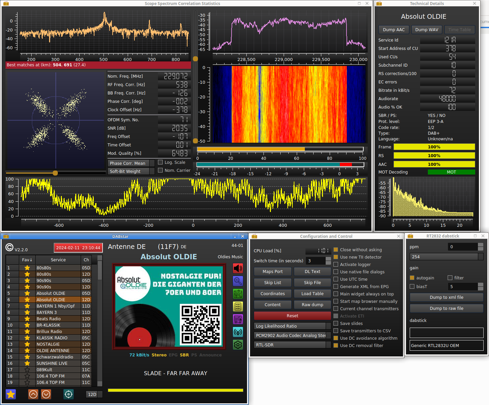
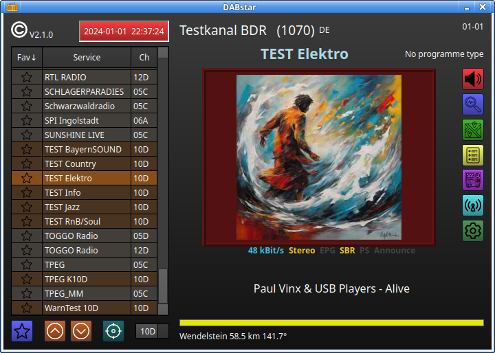
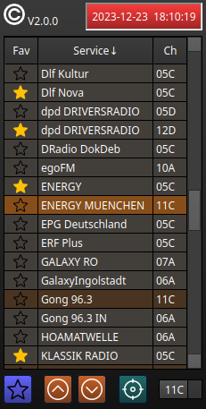
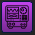
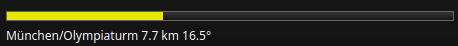

# DABstar

---



## Table of Content
<!-- TOC -->
  * [Introduction](#introduction)
  * [What is new in 2.2.0](#what-is-new-in-220)
  * [What is new in 2.1.0](#what-is-new-in-210)
  * [What is new in 2.0.0](#what-is-new-in-200)
    * [Buttons are icons now](#buttons-are-icons-now)
    * [Service List](#service-list)
      * [Favorites](#favorites)
      * [Sorting](#sorting)
      * [Channel Buttons](#channel-buttons)
      * [Target Button](#target-button-)
    * [Some help for scanning](#some-help-for-scanning)
  * [How to apply TII info](#how-to-apply-tii-info)
  * [Installing on Linux](#installing-on-linux)
    * [USRP UHD](#usrp-uhd)
    * [QWT installation / building](#qwt-installation--building)
      * [Original description](#original-description)
      * [QWT short build description](#qwt-short-build-description)
  * [Licences](#licences)
<!-- TOC -->

## Introduction

**Version 2.2.0 is out!**

Beside many small things under the hood I did major changes in the Look & Feel and mainly in the service selection.
So I decide to make a major step to version 2 in the version numbering.

[DABstar](https://github.com/tomneda/DABstar) was originally forked from Jan van Katwijk's great work of [Qt-DAB](https://github.com/JvanKatwijk/qt-dab) 
from [commit](https://github.com/JvanKatwijk/qt-dab/commits/b083a8e169ca2b7dd47167a07b92fa5a1970b249) ([tree](https://github.com/JvanKatwijk/qt-dab/tree/b083a8e169ca2b7dd47167a07b92fa5a1970b249)) from 2023-05-30. Some fixes afterwards to Qt-DAB are included.

As there are huge changes and additions (but also reductions) made from my side and there will be bigger changes in the future, 
I decided to give it the new name **DABstar**.

I saw that with starting of Qt-DAB 6.x, it uses also new code parts and ideas from here. I am very appreciated about this :smiley:.
This is of course very acknowledged that my work can give something back.

I will try to maintain always a working state on `main` branch.
Only when I change the MAJOR (1st digit) and/or MINOR (2nd digit) part of the version number (see [https://semver.org/](https://semver.org/) for nomenclature)
I will describe the changes here.
If I only raise the PATCH version number (3rd digit) when I provide (urgent) intermediate patches.

For at least each new version change in the MAJOR and/or MINOR part I will provide a version tag for easy referencing.
Please use the tags page on Github: [https://github.com/tomneda/DABstar/tags](https://github.com/tomneda/DABstar/tags).


Meanwhile, I provide AppImages but still no Windows build. See [Link](https://github.com/tomneda/DABstar/releases).

As this README got meanwhile quite long, I cut off the description regarding versions until 1.7.1, but you can still read
it here: [README.md of V1.7.1](https://github.com/tomneda/DABstar/blob/649431e0f5297a5f44cd7aab0c016370e010ed3e/README.md)

## What is new in 2.2.0

- A bigger fix replaying files regarding my new service list. 
  There is still the small issue that the channel name does not (necessarily) fit to the file content.
- There is only one file-reading dialog now. The file type selection happens in the file dialog field. 
  It is selectable whether the QT or native file dialog should be shown.   
- Improve error checking for file handling.
- Refine the setting management. 
  This causes that the setting file (in `~/.config/dabstar/`) got a new filename. 
  So, the settings has to be put-in new.  
  Same happens to the service-list database file, so possibly already made favorites got lost.
  Sorry for that circumstance.
- Small UI refinements.
- Many small refinements under the hood.

## What is new in 2.1.0

- Some minor fixes and refinings made.
- Add status information to the main Widget, see below the MOT picture: 
  - Show the ACC decoder input bit rate.
  - Show whether Stereo mode is active.
  - Show whether EPG (Electronic Program Guide) data are available
  - Show whether SBR (Spectrum Band Replication) mode is active
  - Show whether PS (Parameter Stereo) mode is active
  - Show whether an announcement is currently made. 



(move over the status elements like **SBR** or **PS** to get tooltip information)

## What is new in 2.0.0

### Buttons are icons now

I replaced all buttons on the main window to quadratic ones with icons on it. 
Some have animations or change colors or the icon itself after clicking. 
See the tooltips for further information what each button does.
         
### Service List

The major new thing is the complete new written service selector on the left side of the main window:


  
The list is stored as a SQlite database in the folder `~/.config/dabstar`. 
The list will be filled when selecting a new channel (with eg. the combobox on the right bottom corner in the picture) 
or click the "Scan" button  to scan all typical DAB channels.
While the scan is running the button is animated. 

The current selected service is shown with an orange background. 
With the brown colored entries, you will find other services from the same channel (here 11C). 
When you click on such services the switching time is quite short. 

The services with a gray background are from another channel. 
Selecting this will take a bit longer time (about 3 seconds) till audio comes up.
Note: Not each service entry has audio, especially that with SPI and EPG in its name. 

#### Favorites

You can select a current running service as a favorite by clicking . 
Click the same button again to deselect the favorite state. 
On the left side of the service list you will see an active favorite state.
The favorites are stored separately with the service list, so a re-scan would not delete them.
   
#### Sorting

When you click on the header description you can change the sorting of the columns. Selecting the "Fav" column behaves that way
that the favorites always located on the top but the service column will be sorted (ascending oder descending).

#### Channel Buttons

With the up/down-buttons  you can step one service up or down in the list (with wrap-around). 
Change the sorting of the list if you only want mainly to step within the favorites or within the same channel.

#### Target Button     

If you "lose" the orange current service selection you can click this button . 
The current service will be shown in the list center (if possible).

### Some help for scanning

For a successful reception a good leveling of the device is necessary. 
Click  to open the device widget (it differs for the different devices). 
The best feedback regarding signal quality can be seen on the **Spectrum Scope** with
. 
There, many explanations would be necessary for the details. Look at the tool tips for further help there.

For a faster signal check you would see the yellow bar 



below the picture on the main window.
This bar must reach 100% if the signal is good enough. 

Also, the clock on the top of the service list can be used as indicator. Its time is only shown (and the background light up) if the DAB time information
can be received. 


## How to apply TII info

That the location, distance and direction to the transmitter can be shown, do following:

1) Provide your home coordinates with button **Coordinates** on the "Configuraton and Control" windows.
2) Copy **libtii-lib.so** from project sub folder **/tii-library** to **/usr/local/lib/**    (you will need sudo rights).
3) Click one time **Load Table** on the "Configuraton and Control" window.
4) If 3) should fail you can unzip the content of **/tii-library/tiiFile.zip** to your home folder. Restart DABstar. 
    Here you will maybe not have the newest in 3) downloaded version of the data base.


## Installing on Linux

This is what I needed to install DABstar on a fresh Ubuntu 20.04                     
```
sudo apt-get update
sudo apt-get install git
sudo apt-get install cmake
sudo apt-get install qt5-qmake
sudo apt-get install build-essential
sudo apt-get install g++
sudo apt-get install qt5-default
sudo apt-get install libsndfile1-dev
sudo apt-get install libfftw3-dev
sudo apt-get install portaudio19-dev
sudo apt-get install zlib1g-dev
sudo apt-get install libsamplerate0-dev
sudo apt-get install libfaad-dev
sudo apt-get install libusb-1.0-0-dev
sudo apt-get install libqwt-qt5-dev
```

or same in fewer lines:

```
sudo apt-get update
sudo apt-get install git cmake qt5-qmake build-essential g++ qt5-default libsndfile1-dev libfftw3-dev portaudio19-dev zlib1g-dev libsamplerate0-dev libfaad-dev libusb-1.0-0-dev
sudo apt-get install libqwt-qt5-dev
```
If you have troubles with the last QWT package `libqwt-qt5-dev` try to build QWT for yourself. See [Link](#qwt-installation--building).

Then for building DABstar do:
```
git clone https://github.com/tomneda/DABstar.git
cd DABstar
mkdir build
cd build
cmake .. -DAIRSPY=ON -DSDRPLAY_V2=ON -DSDRPLAY_V3=ON -DHACKRF=ON -DLIMESDR=ON -DRTL_TCP=ON -DPLUTO=ON -DUHD=ON -DRTLSDR_LINUX=ON -DUSE_HBF=OFF -DDATA_STREAMER=OFF -DVITERBI_SSE=ON -DVITERBI_NEON=OFF -DFDK_AAC=OFF
make  
```
Reduce resp. adapt the `cmake` command line for the devices/features you need.

E.G.: If you have an RTL-SDR stick and work on a desktop PC (I have only tested this on an Intel-PC), this should be the minimum recommendation:
```
cmake .. -DRTLSDR_LINUX=ON -DVITERBI_SSE=ON
```

To speed up compilation you can provide `-j<n>` as argument with `<n>` number of threads after the `make` command. E.G. `make -j4`.
Do not choose a too high number (or at my side only providing a `-j`) the system can hang due to running out memory and needed swapping!

Finally, in the build folder you can find the program file which you can start with 
```
./dabstar
```

**Attention:** you can try to install the software with 

```
sudo make install
sudo ldconfig
```

but I had problems running this. Maybe because I used a newer QT version than provided by Ubuntu. 
If you have also problems with the installed version you can undo the installation with 
```
sudo make uninstall
```


### USRP UHD

Best worked for me was building UHD from the repository of Ettus Research.

```
sudo add-apt-repository ppa:ettusresearch/uhd
sudo apt-get update
sudo apt-get install libuhd-dev uhd-host
```

<!-- 
Seems not more necessary relating to Qt-DAB
- sudo apt-get install *pkg-config
- sudo apt-get install *mesa-common-dev
- sudo apt-get install *libgl1-mesa-dev *libqt5opengl5-dev
- sudo apt-get install *qtbase5-dev *libqt5svg5-dev
--> 


### QWT installation / building

#### Original description

https://qwt.sourceforge.io/qwtinstall.html 

#### QWT short build description

1. Download QWT 6.2.0: https://sourceforge.net/projects/qwt/files/qwt/6.2.0/qwt-6.2.0.zip/download
2. Unzip downloaded file and go into unzipped folder
3. comment out line "`QWT_CONFIG += QwtSvg`" with a "#" in file `qwtconfig.pri` if you have problems finding a SVG QT header file
4. `qmake qwt.pro`
5. `make` (you may provide the argument `-jn` for `n` number of used threads)
6. `sudo make install`
                                                
## Licences

Rights of Qt-DAB, Qt, FFTW, portaudio, libfaad, libsamplerate and libsndfile gratefully acknowledged.

Rights of developers of RTLSDR library, SDRplay libraries, AIRspy library and others gratefully acknowledged.

Rights of other contributors gratefully acknowledged.

As I use some icons, I get them from [FlatIcon](https://www.flaticon.com/). The work of the icon authors is very acknowledged: 
- <a href="https://www.flaticon.com/free-icons/electromagnetic" title="Electromagnetic icons">Electromagnetic icons created by muh zakaria - Flaticon</a>
- <a href="https://www.flaticon.com/free-icons/radio-tower" title="radio tower icons">Radio tower icons created by sonnycandra - Flaticon</a>
- <a href="https://www.flaticon.com/free-icons/frequency" title="frequency icons">Frequency icons created by DinosoftLabs - Flaticon</a>
- <a href="https://www.flaticon.com/free-icons/spectrum" title="spectrum icons">Spectrum icons created by JunGSa - Flaticon</a>
- <a href="https://www.flaticon.com/free-icons/spectrum" title="spectrum icons">Spectrum icons created by Eucalyp - Flaticon</a>
- <a href="https://www.flaticon.com/free-icons/target" title="target icons">Target icons created by Pixel perfect - Flaticon</a>

