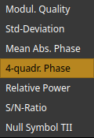
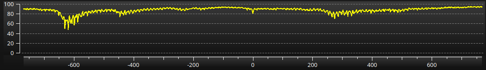
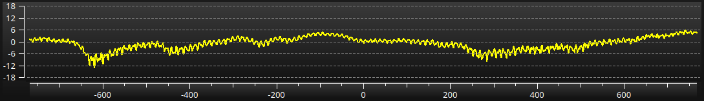
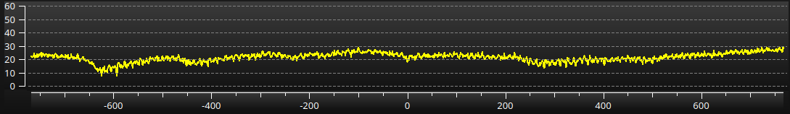
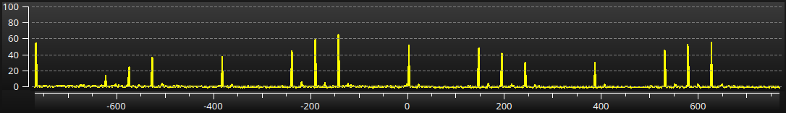

# DABstar

---


## Table of Content
<!-- TOC -->
  * [Introduction](#introduction)
  * [Changes in DABstar version 1.7.1](#changes-in-dabstar-version-171)
  * [Changes in DABstar version 1.7.0](#changes-in-dabstar-version-170)
  * [Changes in DABstar version 1.6.0](#changes-in-dabstar-version-160)
  * [Changes in DABstar version 1.5.0](#changes-in-dabstar-version-150)
  * [Changes in DABstar version 1.4.0](#changes-in-dabstar-version-140)
  * [Changes in DABstar version 1.3.0](#changes-in-dabstar-version-130)
  * [Changes in DABstar version 1.2.0](#changes-in-dabstar-version-120)
    * [What is new?](#what-is-new)
    * [Known things that do not work yet](#known-things-that-do-not-work-yet)
    * [What is the DC Avoidance Algorithm?](#what-is-the-dc-avoidance-algorithm-)
  * [Changes in DABstar version 1.1.0](#changes-in-dabstar-version-110)
    * [What is new?](#what-is-new-)
    * [Things that do not work yet or anymore](#things-that-do-not-work-yet-or-anymore-)
    * [Changes to the Carrier Plot](#changes-to-the-carrier-plot)
  * [Changes in DABstar version 1.0.2](#changes-in-dabstar-version-102)
    * [How to apply TII info](#how-to-apply-tii-info)
  * [Changes in DABstar version 1.0.1](#changes-in-dabstar-version-101-)
    * [Graphical changes](#graphical-changes)
    * [Functional changes](#functional-changes)
    * [Code refactorings](#code-refactorings)
    * [Not more working or removed things](#not-more-working-or-removed-things)
  * [Installing on Linux](#installing-on-linux)
    * [USRP UHD](#usrp-uhd)
    * [QWT installation / building](#qwt-installation--building)
      * [Original description](#original-description)
      * [QWT short build description](#qwt-short-build-description)
<!-- TOC -->

## Introduction

**Current main branch version is [V1.7.1](#changes-in-dabstar-version-171).**

[DABstar](https://github.com/tomneda/DABstar) is originally forked from Jan van Katwijk's great work of [Qt-DAB](https://github.com/JvanKatwijk/qt-dab) 
from [commit](https://github.com/JvanKatwijk/qt-dab/commits/b083a8e169ca2b7dd47167a07b92fa5a1970b249) ([tree](https://github.com/JvanKatwijk/qt-dab/tree/b083a8e169ca2b7dd47167a07b92fa5a1970b249)) from 2023-05-30. Some fixes afterwards to Qt-DAB are included.

As there are meanwhile huge changes made from my side and there will be bigger changes in the future, 
I decided to give it the new name **DABstar**.

I will try to maintain always a working state on `main` branch.
Only when I change the MAJOR (1st digit) and/or MINOR (2nd digit) part of the version number (see [https://semver.org/](https://semver.org/) for nomenclature)
I will describe the changes here.
If I only raise the PATCH version number (3rd digit) when I provide (urgent) intermediate patches.

For at least each new version change in the MAJOR and/or MINOR part I will provide a version tag for easy referencing.
Please use the tags page on Github: [https://github.com/tomneda/DABstar/tags](https://github.com/tomneda/DABstar/tags)

For building there is one bigger difference to Qt-DAB: I maintain only one GUI version and I provide no *.pro file for qmake anymore, only a CMakeLists.txt file.
So, use only the cmake related installation process.

I saw that with starting of Qt-DAB 6.x, it uses also code parts and ideas from here. I am very appreciated about this :smiley:. 
This is of course very acknowledged that my work can give something back.

Meanwhile I provide AppImages but still no Windows build. See [Link](https://github.com/tomneda/DABstar/releases).

## Changes in DABstar version 1.7.1

Beside minor things I setup an AppImage builder and was able to build an AppImage based on Ubuntu 20.04. So, using an older version will possibly not work.

## Changes in DABstar version 1.7.0

Many bigger changes made, including:

- Removing the sorting options for the service list from the **Configuration and Control** widget. The service list is always sorted alphabetically now.
- In the **Technical Details** widget the **SBR (Spectral Band Replication)** and **PS (Parameter Stereo)** status is shown. This works only with HE-AAC (MP4) decoding.
- Refactor the device handler interface, make interface pure virtual to not forget implementing any importing interface of new devices in future.
- I found a not yet used **UHD/USRP** framework code in the Qt-DAB files. As I have an USRP B200 I expand this code and support USRP devices now (runs in the graphic above). The _ppm_ and _kHz_ field is not working yet.
- Minor fix in SDRPlay (V3) device (change bit width). But still seems to be minor leveling issue there.
- Refactor the ring buffer to use less memory.
- Refine the scaling of the spectrum and waterfall scope. The scaling itself is done automatically now. The slider on the left is some kind of zoom between the full level range and the relevant part of the signal.
  Using flat-top window for more precise level readings.
- I try to reduce the many task bar icons for each widget to only one. This works (almost) fine on XFCE but I don't know how it behaves on e.g. Gnome. Please let me know if you suffer from this new behavior: [Link](https://github.com/tomneda/DABstar/issues).
- The most important improvement for me at last: A colleague told me about this paper: [https://ipnpr.jpl.nasa.gov/progress_report/42-184/184D.pdf](https://ipnpr.jpl.nasa.gov/progress_report/42-184/184D.pdf) 
  where in chapter V is something told about **LLR (Log Likelihood Ratio)** using for the viterbi soft-bit generation. I did an implementation of this and the result was really amazing with a weak receiving channel. 
  This new detection perform obviously better than all of the former implemented soft-bit generators.
  So I make it to the default soft-bit generator. In the **Configuration and Control** widget you can still try out the other soft-bit generators. If you have another experience with that please let me know.
 
## Changes in DABstar version 1.6.0

- Still many refactorings in code and GUI and file organizations made.
- Clock Offset is now shown in Hz relative to the sample frequency of 2.048 MHz.
- Provide a DC removable filter, selectable via _Configuration and Control_ widget.
- The IQ Scope allows analysis of DC component and DC removal algorithm.
- Instead of the average _Std. Deviation_ of the phase a more intuitive _Modulation Quality_ in percent is shown now.
- Provide a meter which shows graphically the _Modulation Quality_. This helps for leveling the device gain.
- Provide a input signal peak meter to see ADC overdriven situations.
- Many changes in the HackRf device handler:
    - Make the _ppm_ selections somehow work via a workaround.
    - GUI changes, shows more device details.
    - Provide 4-times oversampling as HackRf suggested using at least 8 MHz sample rate.
      This needs to include the **liquid-dsp** library due to the needed half-band filters (see [https://github.com/jgaeddert/liquid-dsp](https://github.com/jgaeddert/liquid-dsp)).
      To activate this option use `-DUSE_HBF=ON` for CMake build. I intend to get rid of this dependence in future.

## Changes in DABstar version 1.5.0
                                   
- Still many refactorings made.
- Fix some issues (introduced by myself in the past).
- Some adaptions in the GUI regarding size of elements and colors. 
- Change the default soft-bit calculation strategy (was patch to V1.4.1).
- Avoid flickering in the spectrum scope due to the Null symbol.
- Add two new outputs for the carrier scope:
  - **Null Sym. no TII**: Shows the averaged Null symbol level without TII carriers in percentage of the maximum peak.
  - **Null Sym. ovr. Pow.**: Shows the averaged Null symbol (without TII) power relation to the averaged overall carrier power in dB. 
    This reveals disturbing (non-DAB) signals which can degrade decoding quality.

## Changes in DABstar version 1.4.0

- Move style sheet to local resource file.
- Improve (imo) the waterfall color scheme.
- Selector for soft-bit calculation algorithm on **Configuration and Control** widget.
- Add further soft-bit generation schemes (for experimenting while bad receiving conditions).
- Refine hugely (in the background) **Select Coordinates** widget and place clickable URLs on that for some maps websites to grab the coordinates there (still by hand). 

## Changes in DABstar version 1.3.0

- Further many refactorings and some fixes made.
- Many adaption regarding waterfall display (there is still room for improvement in the coloring).
- Some UI adaptions.
- Internal resources packed, so the executable footprint got smaller.
- The combo boxes in the **Scope Plot** are stored persistently.
- Remove **Scan Mode** selector and no asking for storing scan data to facilitate the scanning process.
- Change the default coloring after first installation of the different spectrum plots.
- New pause slide.

## Changes in DABstar version 1.2.0

### What is new?

- Many code and UI refactorings made and some minor fixes.
- Introduce a **DC Avoidance Algorithm** (default off). With that the RF frequency offset and baseband frequency offset are shown independently.
- Introduce a phase error correction per OFDM carrier. This can be seen in the Carrier Plot with **Corr. Phase Error**. The former **Mean Absolute Phase** plot got obsolete as this would only show a straight line after that correction.
  This phase correcton should be in most cases very minor, so no big effect (a better decoding) should be expected.
- The IQ plot can now show different views where one view shows the still not phase corrected versions. 
- Fixes in Carrier **Null Symbol TII** plot (wrong scaling calculation).

### Known things that do not work yet

- The settings of the current view of the IQ plot and Carrier plot cannot stored persistently.

### What is the DC Avoidance Algorithm? 

This new feature tries to avoid the DC component on used OFDM-bins around the 0Hz-OFDM-bin.

Many SDR devices have an analog IQ receiving concept. This concept tends to have a DC component at 0Hz baseband.

Therefore, the DAB standard do not use the OFDM-bin at 0Hz to avoid decoding problems. But as the frequency correction 
is usually done only in the baseband, the DC could be seen also in the neighbor OFDM-bins where the demodulation of the data could be badly influenced.

This feature tries to use the RF synthesizer on the SDR device to shift the DC component to the unsused 0Hz-OFDM-bin. The remaining frequency correction is still done in the baseband.

Not all devices allows fine RF frequency tuning (and not on all relevant frequencies), so this is not always working fully well, but should also not cause any harm.

This feature should make a difference in bad reception conditions. See needed RS (Reed-Solomon) correction.

Use the checkbox **Use DC avoidance algorithm** on the **Configuration and Control** page to control this feature. 
The audio could drop for a short time after switching.

## Changes in DABstar version 1.1.0
 
As there are many changes done in the UI and also in the background, I did a bigger step in the version numbering.

### What is new? 
 
- Many code refinements regarding SonarLint and ClangTidy in different modules.
- Refine coloring in the UI.
- New soft-bit evaluation for the Virterbi decoder. It should theoretically (imo) be better than the old one but I could not clearly prove that.
- Add further outputs to the **Carrier Plot** which are selectable (see more details below).
- Many changes in the processing of the OFDM decoder were necessary to realize the two points before.
- The buttons to open/close the widgets for **Controls**, **Spectrum**, **Details** are moved to the main widget.
- Add a frame around the picture and make its size fix.
 
### Things that do not work yet or anymore 
- The **IQ Scope** is prepared for different kinds of outputs but not yet selectable.
- The TII widget is removed at it is replaced by the **Carrier Plot**.
- The SNR widget is removed without replacement. I see no really need for that and I want to get rid of too many widgets.

### Changes to the Carrier Plot

The **Carrier Plot** are able to show different plots which are all related to the used 1536 OFDM carrier:



If the check-box **Nom carrier** (Nominal carrier) is checked then the carriers are sorted in the logical numbering after the frequency interleaver. But the following explained plots would not look nice if doing this. So better let this check-box unchecked.

- **Modulation Quality:** The value 0...100% shows the quality how sure the carrier can be decoded. This value is used for the soft bit decision at the viterbi decoder. The higher the better.  
    
- **Standard Deviation:** This is the basis for the Modulation Quality: the standard deviation (in °) of the noise of the phase. The lower the better.
    
- **Mean Absolute Phase:** This is the average over many OFDM symbols of the absolute decoded phase. Best is a straight line at 45°. A bigger frequency offset would show a slope here.
    
- **4-quadrant Phase:** This shows the IQ Plot in another way: the current phase of the 4 possible quadrants. Best would be 4 (overlaid seen) "lines" at -135°, -45°, +45° and +135°.
    
- **Relative Power:** As the absolute power is difficult to measure, this shows the power (in dB) relative to the medium over all carriers. A most straight line would imply the better signal quality (less fading).
      
- **S/N-Ratio:** This is ratio between the signal power and the noise power in dB. A higher value is better.  
    
- **Null Symbol TII**: This is the replacement of the old TII Scope. It shows the TII (Transmitter Identification Information) carriers within certain Null Symbols. The content is shown decoded on the right corner in the main widget ("TII: ...").
    

## Changes in DABstar version 1.0.2

- Applied latest fixes from Qt-DAB up to [commit](https://github.com/JvanKatwijk/qt-dab/commit/775dc3d9411545ecd07480f625b499f292998818) from 2023-08-13.
- Minor changes in GUI.
- Further different class refinements.
- Handling of the TII distance info improved

### How to apply TII info

That the name, distance and direction to the transmitter can be shown, do following:

1) Provide your home coordinates with button **Coordinates** on the "Configuraton and Control" windows.
2) Copy **libtii-lib.so** from project sub folder **/tii-library** to **/usr/local/lib/**    (you will need sudo rights).
3) Press one time **Load Table** on the "Configuraton and Control" window.
4) If 3) should fail you can unzip the content of **/tii-library/tiiFile.zip** to your home folder. Restart DABstar. 
    Here you will maybe not have the newest in 3) downloaded version of the data base.


## Changes in DABstar version 1.0.1 

**Qt 5.15.2** is used for build.

### Graphical changes

- Added the correlation graph together with the spectrum/waterfall view.  
- Below the correlation graph it is shown the relative distance in kilometers and miles behind the second (and more) matched markers. 
- The IQ diagram is updated faster and lets show the data in logarithmic and linear scale (switchable).
- There is a new *Phase vs. Carrier* graph which shows the decoded phase component of each of the OFDM carrier. 
- Exchange the Qt-DAB color selector with the more flexible Qt color selector.
- Adapt the looking of the GUI (adapt style sheet).
- New desktop logos for program symbol. The main window symbol is brighter in the task bar to distinguish it from the other sub windows more easily.
- Simplify clock and runtime display.
- New DAB logo on pause slide:  
     

### Functional changes

- Faster establishment to a new DAB channel (maybe this *could* be bad in poor receiving conditions).
- No modal message boxes anymore if a channel or service establishment fails. The message is shown red colored in the main window instead.
- Introduce a state machine in DAB processor to get rid of the `goto` and make the code more readable (imo).
- Fine phase adjustment in OFDM decoder (the "cross" in the IQ diagram should now looking balanced if it was not before).
- Many minor changes I almost forgot. :blush:

### Code refactorings

*(with RTL-SDR, HackRf, SdrPlay device libs included, other device libs not touched yet)*

- Do many code refactories regarding better readability (in my opinion) and higher compile speed (removing obsolete headers and code).
- Remove all gcc warnings.
- Find deep `std::vector` copies at method interfaces and replace them with const reference vectors.
- Find non-const input C array pointers and turned them to const (while this I found an unwanted memory changing issue which probably had no side effect).
- Use SonarLint on some code parts (this leads to e.g. using `std::array` templates).
- Make the FFT part to an own lib (was experimental and not really necessary).

### Not more working or removed things

- Coloring each button with an individual color is not more possible (took a huge amount of code).
- Remove obsolete code (with no functional lack).
- Remove the timer behind the mute button (I got really a shock as suddenly the muting timed out at a loud audio level :unamused: ).
- Remove the schedule feature (I had no use for that sophisticated feature and hinders doing the refactoring).
- The color selector for the graph background is removed as the stylesheet would overwrite this.

## Installing on Linux

This is what I needed to install DABstar on a fresh Ubuntu 20.04                     
```
sudo apt-get update
sudo apt-get install git
sudo apt-get install cmake
sudo apt-get install qt5-qmake
sudo apt-get install build-essential
sudo apt-get install g++
sudo apt-get install qt5-default
sudo apt-get install libsndfile1-dev
sudo apt-get install libfftw3-dev
sudo apt-get install portaudio19-dev
sudo apt-get install zlib1g-dev
sudo apt-get install libsamplerate0-dev
sudo apt-get install libfaad-dev
sudo apt-get install libusb-1.0-0-dev
sudo apt-get install libqwt-qt5-dev
```

or same in fewer lines:

```
sudo apt-get update
sudo apt-get install git cmake qt5-qmake build-essential g++ qt5-default libsndfile1-dev libfftw3-dev portaudio19-dev zlib1g-dev libsamplerate0-dev libfaad-dev libusb-1.0-0-dev
sudo apt-get install libqwt-qt5-dev
```
If you have troubles with the last QWT package `libqwt-qt5-dev` try to build QWT for yourself. See [Link](#qwt-installation--building).

### USRP UHD

Best worked for me was building UHD from the repository of Ettus Research.

```
sudo add-apt-repository ppa:ettusresearch/uhd
sudo apt-get update
sudo apt-get install libuhd-dev uhd-host
```

<!-- 
Seems not more necessary relating to Qt-DAB
- sudo apt-get install *pkg-config
- sudo apt-get install *mesa-common-dev
- sudo apt-get install *libgl1-mesa-dev *libqt5opengl5-dev
- sudo apt-get install *qtbase5-dev *libqt5svg5-dev
--> 


### QWT installation / building

#### Original description

https://qwt.sourceforge.io/qwtinstall.html 

#### QWT short build description

1. Download QWT 6.2.0: https://sourceforge.net/projects/qwt/files/qwt/6.2.0/qwt-6.2.0.zip/download
2. Unzip downloaded file and go into unzipped folder
3. comment out line "`QWT_CONFIG += QwtSvg`" with a "#" in file `qwtconfig.pri` if you have problems finding a SVG QT header file
4. `qmake qwt.pro`
5. `make` (you may provide the argument `-jn` for `n` number of used threads)
6. `sudo make install`
                                                
## Licences


- <a href="https://www.flaticon.com/free-icons/electromagnetic" title="Electromagnetic icons">Electromagnetic icons created by muh zakaria - Flaticon</a>
- <a href="https://www.flaticon.com/free-icons/radio-tower" title="radio tower icons">Radio tower icons created by sonnycandra - Flaticon</a>
- <a href="https://www.flaticon.com/free-icons/frequency" title="frequency icons">Frequency icons created by DinosoftLabs - Flaticon</a>
- <a href="https://www.flaticon.com/free-icons/spectrum" title="spectrum icons">Spectrum icons created by JunGSa - Flaticon</a>
- <a href="https://www.flaticon.com/free-icons/spectrum" title="spectrum icons">Spectrum icons created by Eucalyp - Flaticon</a>
- <a href="https://www.flaticon.com/free-icons/target" title="target icons">Target icons created by Pixel perfect - Flaticon</a>
