# DABstar

## Table of Content
<!-- TOC -->
  * [Table of Content](#table-of-content)
  * [Pictures from V5.0.0](#pictures-from-v500)
    * [Ensemble List window (device mode)](#ensemble-list-window-device-mode)
    * [Ensemble List window (file mode)](#ensemble-list-window-file-mode)
    * [Main window](#main-window)
    * [Configuration window](#configuration-window)
    * [Scope Spectrum Correlation Statistic window](#scope-spectrum-correlation-statistic-window)
    * [FIB content window](#fib-content-window)
    * [Journaline window](#journaline-window)
    * [TII-list window which shows received transmitter details](#tii-list-window-which-shows-received-transmitter-details)
    * [Map view of received transmitters](#map-view-of-received-transmitters)
    * [DABstar version update dialog](#dabstar-version-update-dialog)
    * [Technical details window of the selected service](#technical-details-window-of-the-selected-service)
    * [The PRS correlation window of a whole DAB frame (CIR)](#the-prs-correlation-window-of-a-whole-dab-frame-cir)
    * [Some of the device windows](#some-of-the-device-windows)
  * [Releases](#releases)
  * [Introduction and history](#introduction-and-history)
  * [What is new in V5.0.0](#what-is-new-in-v500)
    * [Ensemble List](#ensemble-list)
      * [Two operation modes](#two-operation-modes)
      * [Controls](#controls)
      * [Color coding in the table](#color-coding-in-the-table)
      * [Filter checkboxes](#filter-checkboxes)
      * [Stored data per ensemble](#stored-data-per-ensemble)
    * [Performance improvements with VOLK](#performance-improvements-with-volk)
  * [Service List](#service-list)
    * [Favorites](#favorites)
    * [Sorting](#sorting)
    * [Channel Buttons](#channel-buttons)
    * [Target Button](#target-button)
    * [ANS (Automatic Next Service)](#ans-automatic-next-service)
    * [Some help for scanning](#some-help-for-scanning)
  * [How to apply TII info](#how-to-apply-tii-info)
  * [Installing on Linux from current mainline](#installing-on-linux-from-current-mainline)
    * [QWT installation / building](#qwt-installation--building)
      * [Original description](#original-description)
      * [QWT short build description](#qwt-short-build-description)
    * [Building DABstar](#building-dabstar)
    * [RTL-SDR driver installation](#rtl-sdr-driver-installation)
    * [Installing USRP UHD](#installing-usrp-uhd)
    * [Installing AirSpy](#installing-airspy)
  * [Licences](#licences)
    * [Journaline](#journaline)
<!-- TOC -->

---

## Pictures from V5.0.0

### Ensemble List window (device mode)

The Ensemble List in device/channel scan mode. The table shows all known DAB channels with their
scan status, ensemble name, ensemble ID, ITU country code, signal quality (SNR/MER) and more.
Color coding gives a quick overview: not-yet-scanned channels appear greenish, successfully scanned
ones in a neutral gray, and channels with no detectable signal are highlighted in red.

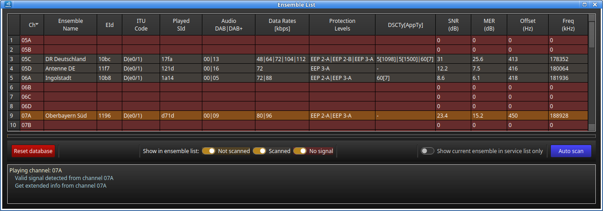

### Ensemble List window (file mode)

The Ensemble List in file playback mode. Here you can add recorded DAB IQ sample files,
have them scanned automatically and keep track of which files contain usable DAB signals.
The "Remove 'No signal' files" button helps clean up the list of invalid recordings.

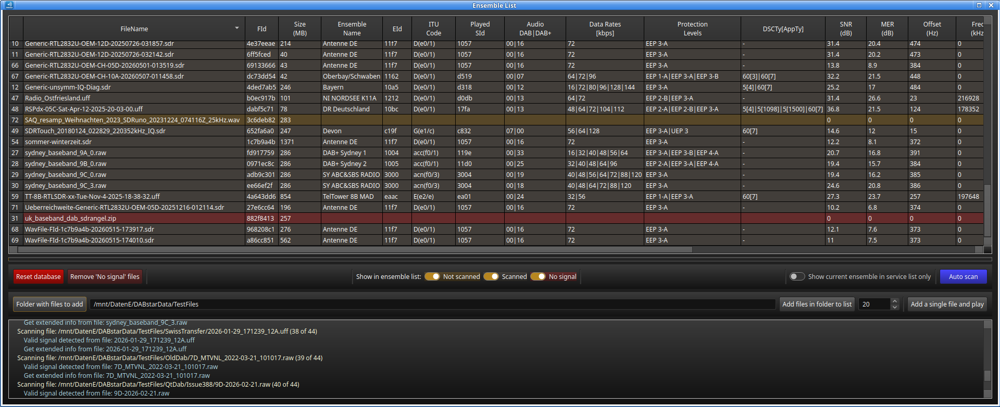

### Main window

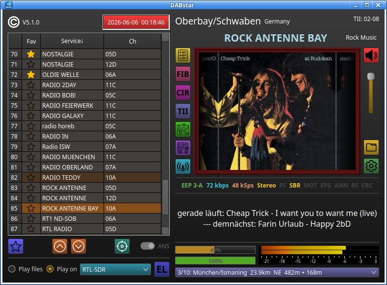

(move over the status elements like **EEP 3-A**, **PS** or **SBR** to get tooltip information)

The status bar below the MOT picture shows:

| Indicator | Meaning                                                                            |
|-----------|------------------------------------------------------------------------------------|
| EEP 3-A   | The current (Viterbi) protection mode                                              |
| 72 kbps   | AAC decoder input bit rate (including MOT data)                                    |
| 48 kSps   | The sample rate to the audio signal                                                |
| Stereo    | Whether stereo mode is active                                                      |
| PS        | Whether Parametric Stereo mode is active                                           |
| SBR       | Whether Spectral Band Replication mode is active                                   |
| MOT       | A Media Object Transfer is currently happening (e.g. Slide Show)                   |
| EPG       | Whether Electronic Program Guide data are available (needs further implementation) |
| Ann       | Whether an announcement is currently being broadcast                               |
| RS        | For DAB+: The Reed Solomon decoder has detected errors (and almost repaired them)  |
| CRC       | The RS decoder was not able to repair the error. Audible noise may occur           |                                                                     


### Configuration window

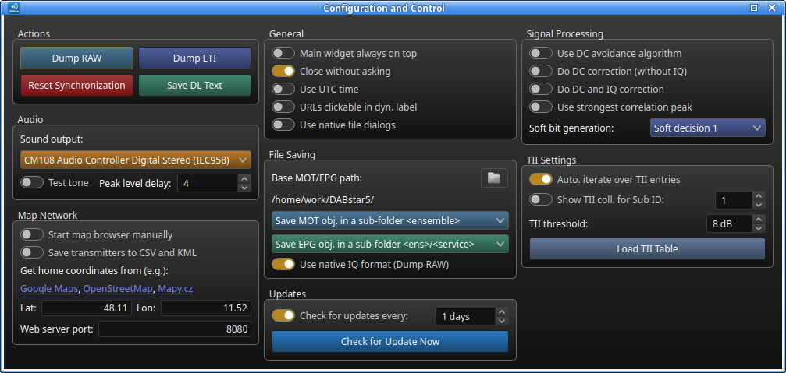


(Use tooltips for detailed explanations)

### Scope Spectrum Correlation Statistic window

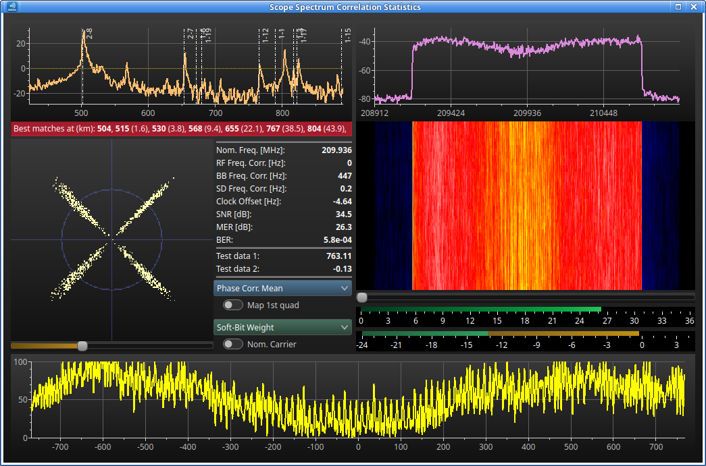

### FIB content window

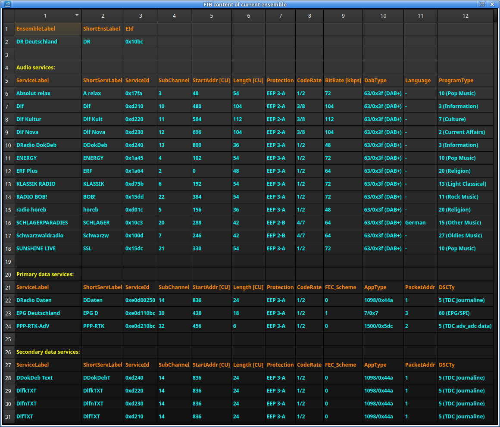

### Journaline window

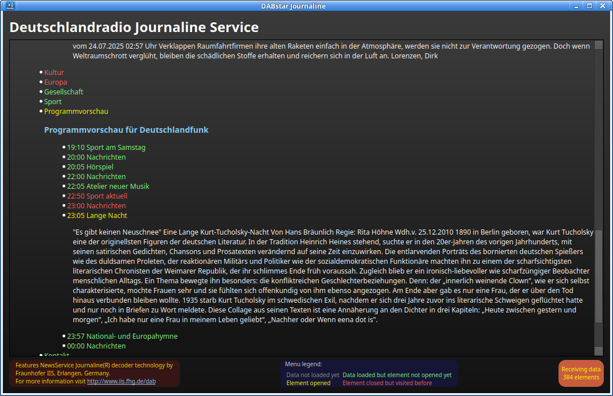

### TII-list window which shows received transmitter details


### Map view of received transmitters


### DABstar version update dialog

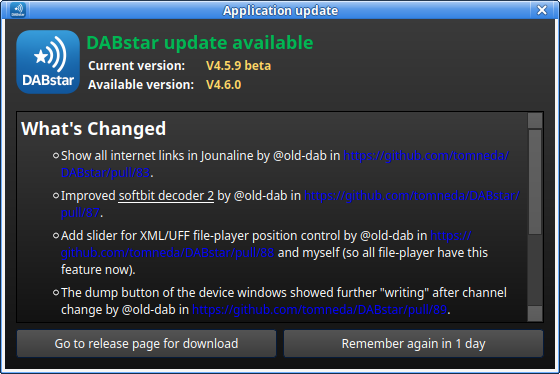

(unfortunately, the link coloring could not be made more readable; it looks better in Windows)

### Technical details window of the selected service

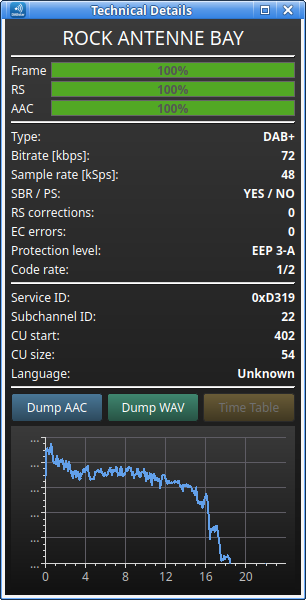

### The PRS correlation window of a whole DAB frame (CIR)

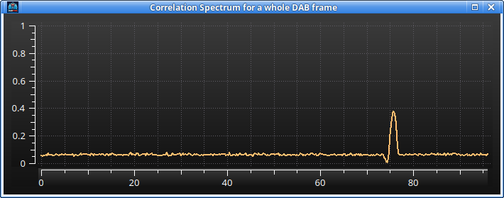

### Some of the device windows

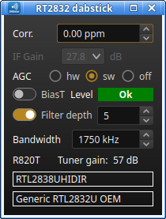
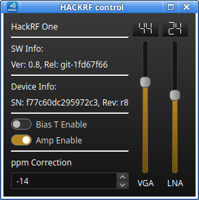
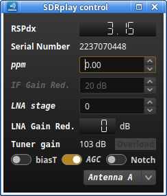

---

## Releases
For the latest AppImage versions see the
[Linux Release Page](https://github.com/tomneda/DABstar/releases/).

[old-dab](https://github.com/old-dab) also provides Windows versions, see the
[Windows Release Page](https://github.com/old-dab/DABstar/releases).
The feature-set could be a bit different between Linux and Windows, even with same version number.

## Introduction and history
[DABstar](https://github.com/tomneda/DABstar) was originally forked from Jan van Katwijk's great work of [Qt-DAB](https://github.com/JvanKatwijk/qt-dab)
from [commit](https://github.com/JvanKatwijk/qt-dab/commits/b083a8e169ca2b7dd47167a07b92fa5a1970b249) ([tree](https://github.com/JvanKatwijk/qt-dab/tree/b083a8e169ca2b7dd47167a07b92fa5a1970b249)) from 2023-05-30. Some fixes and adaptations from Qt-DAB made afterwards are included.

With what now amounts to (not just perceived) hundreds to thousands of hours of work, there are huge changes and additions (but also reductions) made and there will be bigger changes in the future,
I decided to give it the new name **DABstar**.

I noticed that since Qt-DAB 6.x, Qt-DAB also uses new code parts and ideas from here. I very much appreciate this :smiley:.
It is very gratifying that my work can give something back.

I will try to maintain always a working state on the head of the `main` branch, so use this for building the software for yourself.
**Please do not try any other branch besides `main` branch.**
They are intended for development, backups and tests and will not always work in their current state.

Recommended is to checkout a [Tag](https://github.com/tomneda/DABstar/tags) of a released version, these are better tested.


## What is new in V5.0.0

### Ensemble List

The biggest new addition in this development cycle is the **Ensemble List** — a dedicated window
for cataloging and scanning DAB ensembles (groups of radio stations) either from a live SDR
device or from pre-recorded IQ sample files.

**How to open it:** Click the blue "EL" (Ensemble List) button in the main window toolbar.

#### Two operation modes
(Select them on the main window, left from the "EL" button)

| Mode | Description |
|------|-------------|
| Device / Channel scan | Scans all standard DAB channels via the connected SDR device and stores the result for each channel. |
| File scan | Scans a folder (or several folders) of recorded DAB IQ files and catalogs which ones contain valid signal data. |

#### Controls

| Control                                    | Mode      | Description                                                                                                                                                                                                                                       |
|--------------------------------------------|:----------|---------------------------------------------------------------------------------------------------------------------------------------------------------------------------------------------------------------------------------------------------|
| Reset database                             | both      | Clears the entire database for the current mode. Use this to force a complete rescan. *Note: rescanning a large set of files takes time.*                                                                                                         |
| Show current ensemble in service list only | both      | Filters the **Service List** in the main window to show the current selected ensemble only.                                                                                                                                                       |
| Auto Scan                                  | both      | Scans all entries currently visible in the list. Individual rows can also be scanned by clicking them directly.                                                                                                                                   |
| Remove 'No signal' files                   | file only | Removes entries identified as containing no valid DAB signal. The "No signal" filter checkbox must be active to enable this button.                                                                                                               |
| Folder with files to add                   | file only | Specifies the folder path whose files will be added to the database.                                                                                                                                                                              |
| Add files in folder to list                | file only | Adds all files from the selected folder to the database. Non-sample files are accepted and will be flagged as invalid during scanning. Minimum 4 MB per file; maximum 10 000 files to avoid system slowdown.                                      |
| Minimum file size (MB)                     | file only | Files smaller than this threshold are skipped when adding files to the database.                                                                                                                                                                  |
| Add a single file and play                 | file only | Adds one recording to the database and starts playback immediately. Replaces the former "Eject" button. If the file is already in the database it is selected and played. The minimum size threshold does not apply (only the hard 4 MB minimum). |

#### Color coding in the table

The table uses background colors to give a quick status overview:

| Color | Meaning |
|-------|---------|
| Greenish | Channel / file not yet scanned |
| Grayish | Successfully scanned entry |
| Reddish | No signal detected (failed) |

#### Filter checkboxes

Three filter checkboxes control which entries are visible in the table.
Their state may be changed automatically when a certain scan situation arises.

| Checkbox    | Shows |
|-------------|-------|
| Not scanned | Entries that have not been scanned yet |
| Scanned     | Entries that already have scan data |
| No signal   | Entries where no valid DAB signal was found |

#### Stored data per ensemble

The SQLite database stores the following information for each entry (exact fields differ between device and file mode):

| Field               | Description                                                                        |
|---------------------|------------------------------------------------------------------------------------|
| Channel / file path | DAB channel name (device mode) or full file path (file mode)                       |
| FId                 | Unique file identifier — hash of part of the file content (file mode only)         |
| Ensemble name & EId | Human-readable ensemble name and its numeric ensemble ID                           |
| ITU country code    | Country of origin encoded per ITU standard                                         |
| Frequency           | Nominal frequency (if known)                                                       |
| Offset              | The measured baseband offset                                                       |
| Error protection    | Error protection level and scheme parameters                                       |
| DSCTy / AppType     | Service type information, e.g., Journaline, EPG                                    |
| SNR / MER           | Signal-to-Noise Ratio and Modulation Error Ratio                                   |
| Last SId            | Last played Service ID — used to resume the same service after switching ensembles |
| Date                | The date (UTC) which is coded within the DAB signal                                |
| Scan level          | Highest scan level reached (not shown as a column in the list)                     |

---

### Performance improvements with VOLK

Several parts (not only the OFDM decoder) use the [VOLK](https://www.libvolk.org/)
(Vector-Optimized Library of Kernels) library for vectorized signal-processing operations.
This noticeably reduces CPU load especially on machines with SSE/AVX capable processors.
Volk version 3.3.0 or newer is recommended.

---

## Service List

The service selector on the left side of the main window is stored as a SQLite database in the
folder `~/.config/dabstar`.


The current selected service is shown with an orange background.
With the brown colored entries, you will find other services from the same channel (here 12D).
When you click on such services the switching time is quite short.

The services with a gray background are from another channel.
Selecting this will take a bit longer time (about 3 seconds) till audio comes up.
Note: Not each service entry has audio, especially that with SPI and EPG in its name.

### Favorites

You can select a current running service as a favorite by clicking .
Click the same button again to deselect the favorite state.
On the left side of the service list you will see an active favorite state.
The favorites are stored separately with the service list, so a re-scan would not delete them.

### Sorting

When you click on a column header you can change the sorting. Selecting the "Fav" column behaves such that
the favorites are always placed at the top while the service column is sorted (ascending or descending).

### Channel Buttons

With the up/down-buttons  you can step one service up or down in the list (with wrap-around).
Change the sorting of the list if you only want mainly to step within the favorites or within the same channel.

### Target Button

If you "lose" the orange current service selection you can click this button .
The current service will be shown in the list center (if possible).

### ANS (Automatic Next Service)

This is only active in file mode. If active and the file runs to its end, the next service will be played automatically before the file loops again.
This way you can listen to each service in a continuous stream.
Additionally, all slideshow pictures of the services within the files can be captured.


### Some help for scanning

For a successful reception a good leveling of the device is necessary.
Click  to open the device widget (it differs for the different devices).
The best feedback regarding signal quality can be seen on the **Spectrum Scope** with
.
There, many explanations would be necessary for the details. Look at the tooltips for further help there.

Also, the clock on the top of the service list can be used as indicator. Its time is only shown (and the background lights up) if the DAB time information
can be received.


## How to apply TII info

To show the location, distance and direction to the transmitter, do the following:

1) Provide your home coordinates on the "Configuration and Control" window.
2) Check the README.txt in sub folder **/tii-library** and follow the instructions given there (you will need sudo rights).

## Installing on Linux from current mainline

This is what I needed to install DABstar on a fresh Ubuntu 24.04:
```
sudo apt-get update
sudo apt-get install git
sudo apt-get install cmake
sudo apt-get install build-essential
sudo apt-get install g++
sudo apt-get install libsndfile1-dev
sudo apt-get install libfftw3-dev
sudo apt-get install zlib1g-dev
sudo apt-get install libsamplerate0-dev
sudo apt-get install libusb-dev
sudo apt-get install libusb-1.0-0-dev
sudo apt-get install qt6-base-dev
sudo apt-get install qt6-multimedia-dev
```

If you want to build with qmake:
```
sudo apt-get install qmake6
```

As libfaad had issues with low-rate services I switched over to FDK-AAC.
But also the repository version in Ubuntu 24.04 has still flaws with PS (Parametric Stereo) services.
So I recommend to build it for your own. I used the latest main version which is v2.0.3.
```
git clone https://github.com/mstorsjo/fdk-aac.git
cd fdk-aac
git checkout v2.0.3
mkdir build
cd build
cmake ..
make
sudo make install
```

### QWT installation / building

It is recommended to build Qwt 6.3.0 (Qwt 6.2.0 will also work) for yourself. The library delivered with Ubuntu is quite old.

#### Original description

https://qwt.sourceforge.io/qwtinstall.html

#### QWT short build description

1. Download QWT 6.3.0: [Link](https://sourceforge.net/projects/qwt/files/qwt/6.3.0/).
2. Unzip downloaded file and go into unzipped folder.
3. comment out line "`QWT_CONFIG += QwtSvg`" with a "#" in file `qwtconfig.pri` if you have problems finding a SVG QT header file.

```
qmake6 qwt.pro
make
sudo make install`
sudo ldconfig
```
The install process installed a cmake package file to `/usr/local/qwt-6.3.0/lib/pkgconfig/Qt6Qwt6.pc`.
The path variable PKG_CONFIG_PATH in `CMakeLists.txt` refers to this path to find the Qwt-Package.

Strangely, this error can still happen:

```
...
Could not find a package configuration file provided by "Qt6Qwt6" with any
of the following names:

    Qt6Qwt6Config.cmake
    qt6qwt6-config.cmake
...
```
The package description `/usr/local/qwt-6.3.0/lib/pkgconfig/Qt6Qwt6.pc` contains this (last) line:
`Requires: Qt5Widgets Qt5Concurrent Qt5PrintSupport Qt5Svg Qt5OpenGL`, which is strange since this Qwt build was built based on Qt 6.

As the requirements of Qt 6 are already fulfilled,
I could solve the issue with simply commenting out this (last) line with a hash #.
So, the last part of the File should look like this:
```
...
Name: Qwt6
Description: Qt Widgets for Technical Applications
Version: 6.3.0
Libs: -L${libdir} -lqwt
Cflags: -I${includedir}
# Requires: Qt5Widgets Qt5Concurrent Qt5PrintSupport Qt5Svg Qt5OpenGL
```

### Building DABstar
```
git clone https://github.com/tomneda/DABstar.git
cd DABstar
mkdir build
cd build
cmake .. -DAIRSPY=ON -DSDRPLAY=ON -DHACKRF=ON -DLIMESDR=ON -DRTL_TCP=ON -DPLUTO=ON -DUHD=ON -DRTLSDR=ON -DUSE_HBF=OFF -DDATA_STREAMER=OFF -DVITERBI_SSE=ON -DVITERBI_NEON=OFF -DFDK_AAC=ON
make
```
Reduce or adapt the `cmake` command line for the devices/features you need.

E.G.: If you have an RTL-SDR stick and work on a desktop PC (I have only tested this on an Intel-PC), this should be the minimum recommendation:
```
cmake .. -DRTLSDR=ON -DVITERBI_SSE=ON
```

To speed up compilation you can provide `-j<n>` as argument with `<n>` number of threads after the `make` command. E.G. `make -j4`.
Do not choose a too high number (or at my side only providing a `-j`) the system can hang due to running out memory and needed swapping!

Finally, in the build folder you can find the program file which you can start with
```
./dabstar
```

You could try to install the software within your system with
```
sudo make install
sudo ldconfig
```
To uninstall DABstar again, do this:
```
sudo make uninstall
```

### RTL-SDR driver installation

It is recommended to build the RTL-SDR library from source from the repository of old-dab. See https://github.com/old-dab/rtlsdr.

It is also recommended then to remove the default driver, if installed.

If you are using the default driver while running DABStar you will get a message box hinting on that but DABstar will somehow work with that also.

The driver from old-dab should still be compatible with other applications using this driver.

Remove the default driver with:
```
sudo apt remove rtl-sdr librtlsdr-dev
sudo ldconfig
```


If you nevertheless want to use the default version from Ubuntu (but this is not recommended as the driver from old-dab has some improvements):
```
sudo apt install rtl-sdr librtlsdr-dev
sudo ldconfig
```

### Installing USRP UHD

Best worked for me was building UHD from the repository of Ettus Research.

```
sudo add-apt-repository ppa:ettusresearch/uhd
sudo apt-get update
sudo apt-get install libuhd-dev uhd-host
```

### Installing AirSpy

Details see https://github.com/airspy/airspyone_host

```
git clone https://github.com/airspy/airspyone_host.git
cd airspyone_host
mkdir build
cd build
cmake ../ -DINSTALL_UDEV_RULES=ON
make
sudo make install
sudo ldconfig
```

## Licences

Rights of Qt-DAB, AbracaDABra, Qt, Qwt, FFTW, VOLK, FDK-AAC, libfaad, libsamplerate and libsndfile gratefully acknowledged.

Rights of developers of RTLSDR library, SDRplay libraries, AIRspy library and others gratefully acknowledged.

Rights of other contributors gratefully acknowledged.

As I use some icons, I get them from [FlatIcon](https://www.flaticon.com/). The work of the icon authors is gratefully acknowledged:

| Icon set                                                                     | Author        |
|------------------------------------------------------------------------------|---------------|
| [Electromagnetic icons](https://www.flaticon.com/free-icons/electromagnetic) | muh zakaria   |
| [Radio tower icons](https://www.flaticon.com/free-icons/radio-tower)         | sonnycandra   |
| [Frequency icons](https://www.flaticon.com/free-icons/frequency)             | DinosoftLabs  |
| [Spectrum icons](https://www.flaticon.com/free-icons/spectrum)               | JunGSa        |
| [Spectrum icons](https://www.flaticon.com/free-icons/spectrum)               | Eucalyp       |
| [Target icons](https://www.flaticon.com/free-icons/target)                   | Pixel perfect |
| [Folder icons](https://www.flaticon.com/free-icons/folder)                   | gariebaldy    |

### Journaline

Features NewsService Journaline(R) decoder technology by
Fraunhofer IIS, Erlangen, Germany.
For more information visit http://www.iis.fhg.de/dab
