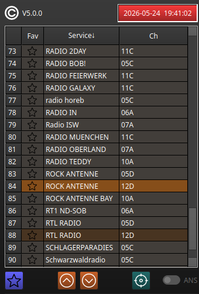

# Service List

The service selector on the left side of the main window is stored as a SQLite database in the
folder `~/.config/dabstar`.

{width=45%}

The current selected service is shown with an orange background.
With the brown colored entries, you will find other services from the same channel (here 12D).
When you click on such services the switching time is quite short.

The services with a gray background are from another channel.
Selecting this will take a bit longer time (about 3 seconds) till audio comes up.

Note: Not each service entry has audio, especially that with SPI and EPG in its name.

## Favorites

You can select a current running service as a favorite by clicking
{height=1.1em}.
Click the same button again to deselect the favorite state.
On the left side of the service list you will see an active favorite state.
The favorites are stored separately with the service list, so a re-scan would not delete them.

## Sorting

When you click on a column header you can change the sorting. Selecting the "Fav" column behaves
such that the favorites are always placed at the top while the service column is sorted (ascending
or descending).

## Channel buttons

With the up/down buttons {height=1.1em} you can step one
service up or down in the list (with wrap-around).
Change the sorting of the list if you only want mainly to step within the favorites or within the
same channel.

## Target button

If you "lose" the orange current service selection you can click this button
{height=1.1em}.
The current service will be shown in the list center (if possible).

## ANS (Automatic Next Service)

This is only active in file mode. If active and the file runs to its end, the next service will be
played automatically before the file loops again.
This way you can listen to each service in a continuous stream.
Additionally, all slide show pictures of the services within the files can be captured.

## Some help for scanning

For a successful reception a good leveling of the device is necessary.
Click {height=1.1em} to open the device widget (it
differs for the different devices).

The best feedback regarding signal quality can be seen on the **Spectrum Scope** with
{height=1.1em}.
There, many explanations would be necessary for the details. Look at the tooltips for further help
there, and see the chapter [Scope and Spectrum](60-scope-and-spectrum.md).

Also, the clock on the top of the service list can be used as indicator. Its time is only shown (and
the background lights up) if the DAB time information can be received.
