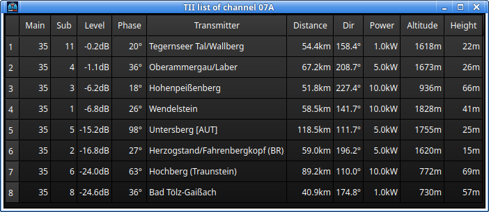
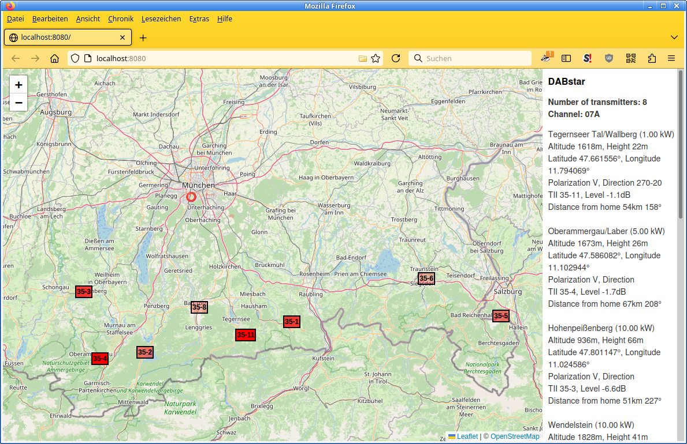

# TII and Map

DAB transmitters send a **Transmitter Identification Information** (TII) code within the null
symbol. DABstar decodes it and, with a transmitter database, can show which transmitters you are
receiving, where they are and how far away they are.

## Setting up TII

To show the location, distance and direction to the transmitter, do the following:

1. Provide your home coordinates on the **Configuration and Control** window, see
   [Configuration](50-configuration.md).
2. Check the `README.txt` in the sub folder [`tii-library`](../../tii-library) of the repository and
   follow the instructions given there (you will need sudo rights).

Without the transmitter database from step 2 the TII codes are still decoded and displayed, but they
cannot be resolved to a transmitter name and location.

## TII list

The TII list shows the details of the currently received transmitters. When several transmitters of
the same single frequency network are received, each of them appears with its own entry.

## Map view

The map view plots the received transmitters geographically. It is not a DABstar window: the map is
served by an internal HTTP server and opens in your default web browser. If the automatic browser
start is switched off in the configuration, open the shown address in a browser yourself.
